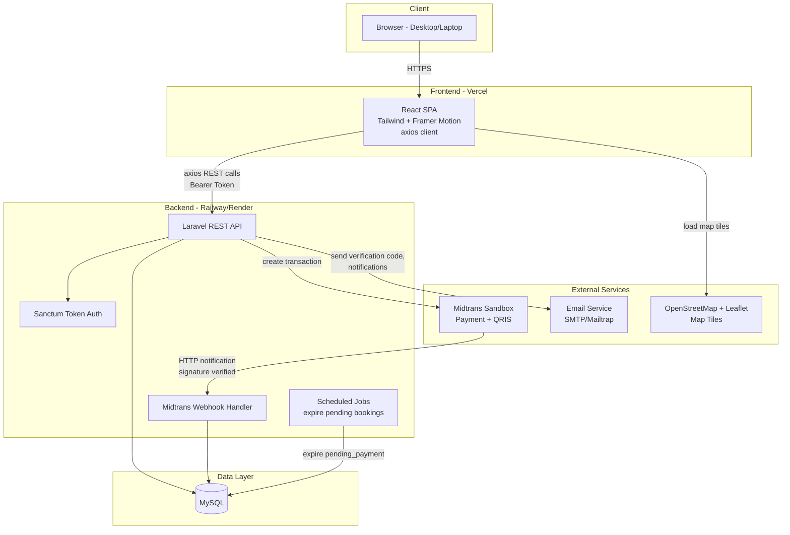
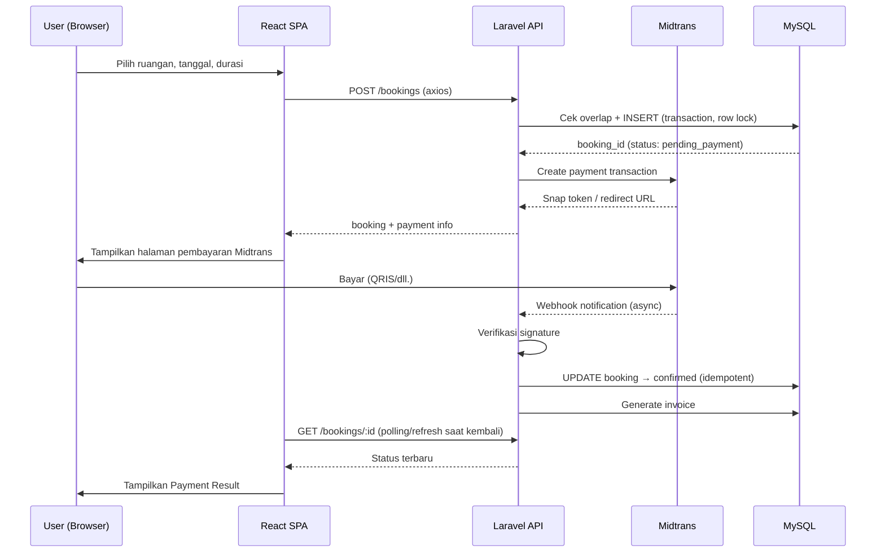
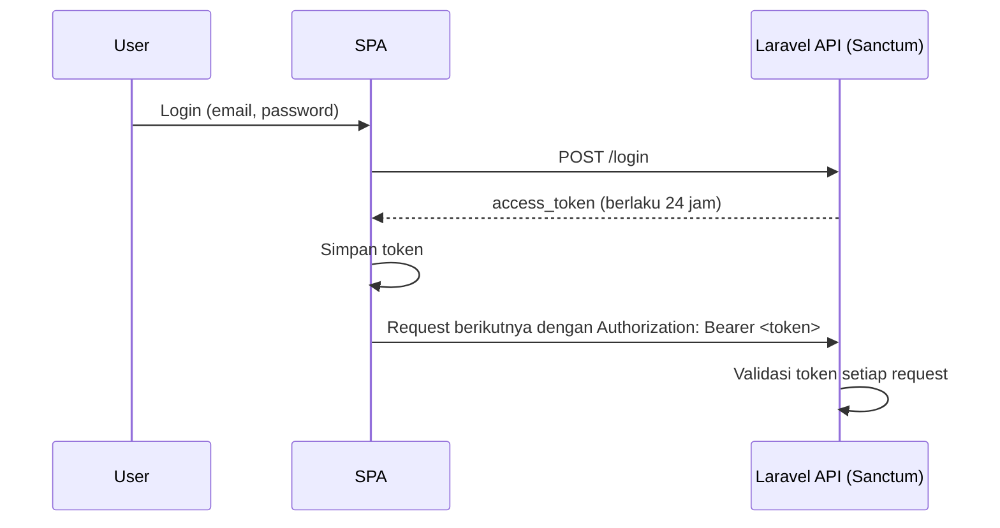
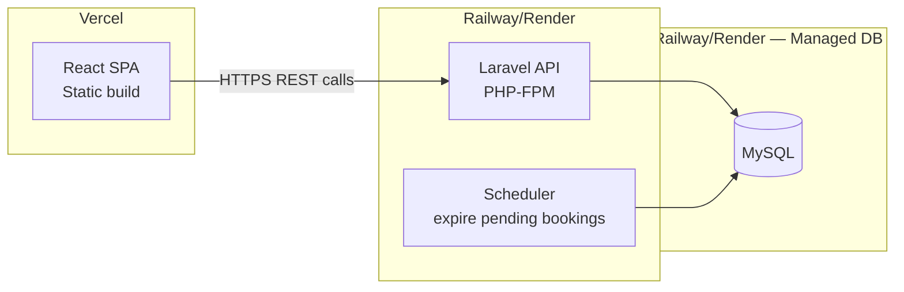

# Architecture Document — FlexOffice

Versi: 1.0 | Cakupan: Arsitektur level tinggi (bukan detail struktur kode)

Dokumen pendamping: `PRD.md`, `SRS.md`, `use-case-diagram.md`

---

## 1. Architecture Style

**Decoupled SPA + REST API.** React SPA (frontend) dan Laravel (backend) adalah dua aplikasi terpisah, berkomunikasi lewat REST API via axios. Tidak memakai Inertia.js — frontend dan backend di-deploy dan di-scale independen.

**Catatan penting:** Vercel hanya mendukung frontend (React) dan serverless Node/Edge functions — **tidak bisa menjalankan Laravel (PHP)**. Jadi backend wajib di-hosting terpisah. Rekomendasi gratis: **Railway** atau **Render** (keduanya punya tier gratis untuk PHP + MySQL). Karena beda origin, autentikasi memakai token (Laravel Sanctum), bukan session cookie berbasis domain.

---

## 2. High-Level Component Diagram

---

## 3. Layers

### 3.1 Presentation Layer (React SPA — Vercel)
- Halaman: Search, Room Detail, Booking Checkout, Payment Result, Booking Detail, Transaction History, Invoice View, Profile Settings, Admin Dashboard.
- State management: local/React Context (cukup untuk skala MVP; tidak perlu Redux).
- Komunikasi ke backend murni lewat axios ke REST API — SPA tidak menyimpan business logic, hanya presentasi dan validasi input di sisi klien (validasi asli tetap di server).
- Menyimpan token auth (localStorage/httpOnly cookie — lihat OQ di bagian 6) untuk setiap request `Authorization: Bearer <token>`.

### 3.2 Application Layer (Laravel API — Railway/Render)
- **Auth module:** register, verifikasi email (kode 6 digit), login (Sanctum token), reset password, ganti email.
- **Room module:** CRUD ruangan/gedung (admin), search & filter (publik).
- **Booking module:** cek ketersediaan (transaksi database, row locking), buat booking, expire job (scheduled), cancel, reschedule.
- **Payment module:** integrasi Midtrans (create transaction), webhook handler (verifikasi signature, idempotent update).
- **Invoice module:** generate invoice + PDF setelah booking `confirmed`.
- **Notification module:** simpan & serve notifikasi in-app per user.
- **Admin module:** manajemen refund manual, request persetujuan nonaktifkan ruangan.

### 3.3 Data Layer
- MySQL sebagai satu-satunya sumber data, diakses lewat Eloquent ORM.
- Skema mengikuti data model di `PRD.md` Bagian 7.
- Constraint kritikal: unique index dan row-level locking pada tabel `bookings` untuk mencegah double booking saat concurrent request.

### 3.4 External Integrations
| Layanan | Peran | Arah komunikasi |
|---|---|---|
| Midtrans Sandbox | Pemrosesan pembayaran (QRIS, dll.) | API → Midtrans (create transaction); Midtrans → API (webhook) |
| Email service | Kode verifikasi, reset password, notifikasi email | API → Email service |
| OpenStreetMap + Leaflet | Render peta lokasi | SPA → OSM (langsung dari browser, tidak lewat backend) |

---

## 4. Key Request Flows

### 4.1 Booking + Payment Flow

### 4.2 Auth Flow (Token-Based)

---

## 5. Deployment View

- **Frontend:** build React di-deploy sebagai static site di Vercel (free tier).
- **Backend:** Laravel di-deploy sebagai service PHP di Railway/Render (free tier), termasuk scheduler untuk job expire booking.
- **Database:** MySQL managed instance dari Railway/Render (free tier), atau alternatif gratis seperti PlanetScale bila ingin terpisah dari backend hosting.
- **CORS:** backend wajib mengizinkan origin domain Vercel secara eksplisit (bukan wildcard `*`) karena token dikirim di header Authorization.

---

## 6. Open Questions

- **OQ-ARCH-1:** Token disimpan di `localStorage` (rawan XSS tapi simpel untuk SPA murni) atau lewat `httpOnly cookie` + CSRF token (lebih aman, tapi butuh setup CORS/cookie cross-domain yang lebih rumit antara Vercel dan Railway/Render)? Untuk MVP portofolio saya sarankan `localStorage` demi kesederhanaan — setuju?
- **OQ-ARCH-2:** Job "expire pending booking" dijalankan pakai Laravel Scheduler (`cron`) — apakah platform hosting pilihanmu (Railway/Render) mendukung cron job di tier gratis? Perlu dicek saat memilih platform pasti.
- **OQ-ARCH-3:** MySQL managed di Railway/Render, atau mau host terpisah (mis. PlanetScale free tier)?
