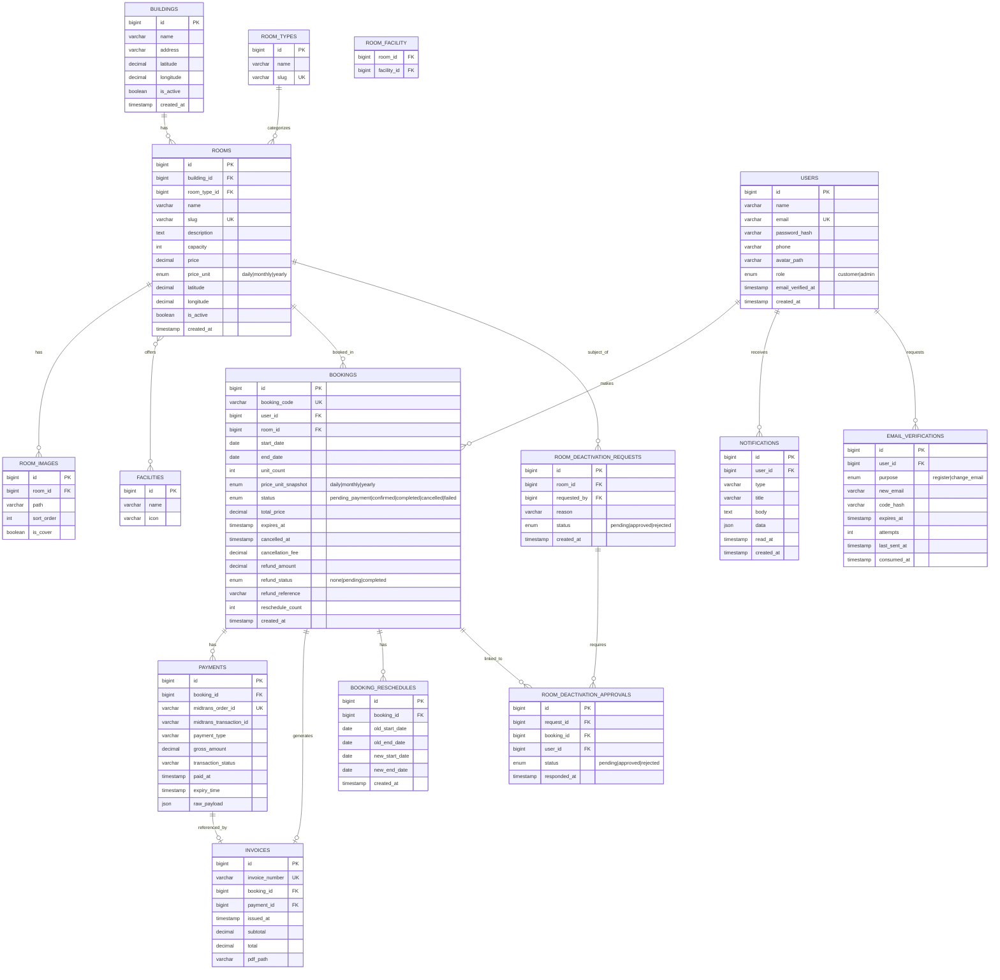
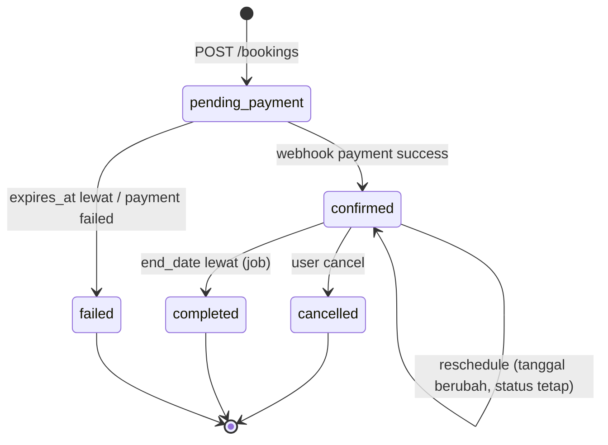
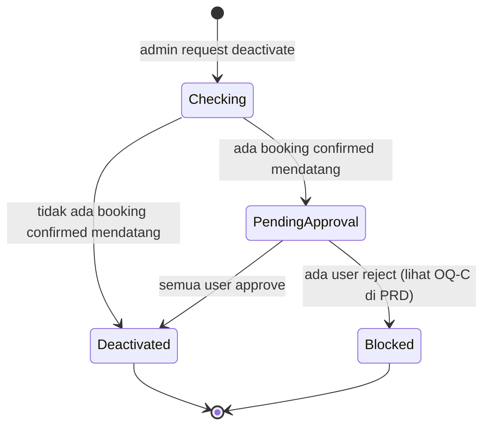
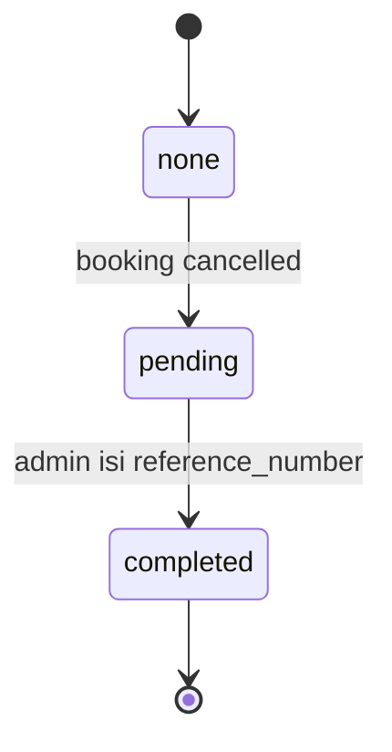

# System Design Document — FlexOffice

Versi: 1.0 | Turunan dari: `ARCHITECTURE.md`, `SRS.md`, `PRD.md`

Dokumen ini merinci hal-hal yang tidak dibahas di level arsitektur: skema database lengkap, kontrak API, alur status, dan algoritma kunci.

---

## 1. Entity Relationship Diagram (Detail)



**Indexing strategy (kritikal untuk performa & integritas):**
- `bookings`: composite index `(room_id, start_date, end_date)` untuk cek overlap cepat; index terpisah pada `status`, `user_id`, `expires_at`.
- `payments`: unique index pada `midtrans_order_id`.
- `email_verifications`: index pada `(user_id, purpose)`.
- `invoices`: unique index pada `invoice_number`.

---

## 2. API Endpoint Specification

Base URL: `/api/v1`. Auth: Bearer token (Sanctum) kecuali ditandai **Public**.

### Auth
| Method | Endpoint | Auth | Deskripsi |
|---|---|---|---|
| POST | `/auth/register` | Public | Registrasi akun baru |
| POST | `/auth/verify-email` | Public (butuh user_id/email) | Verifikasi kode 6 digit |
| POST | `/auth/resend-code` | Public | Kirim ulang kode verifikasi |
| POST | `/auth/login` | Public | Login, return token |
| POST | `/auth/logout` | Customer/Admin | Invalidate token |
| POST | `/auth/forgot-password` | Public | Kirim tautan reset |
| POST | `/auth/reset-password` | Public (token dari email) | Set password baru |
| POST | `/auth/change-email` | Customer/Admin | Mulai alur ganti email (kirim kode) |
| POST | `/auth/confirm-email-change` | Customer/Admin | Konfirmasi kode untuk email baru |

### Rooms & Buildings (Public read, Admin write)
| Method | Endpoint | Auth | Deskripsi |
|---|---|---|---|
| GET | `/buildings` | Public | Daftar gedung |
| GET | `/rooms` | Public | Daftar ruangan (query: building_id, type, capacity_min, price_min, price_max, date) |
| GET | `/rooms/{slug}` | Public | Detail ruangan |
| GET | `/rooms/{id}/availability?month=YYYY-MM` | Public | Kalender ketersediaan |
| POST | `/admin/buildings` | Admin | Buat gedung |
| PUT | `/admin/buildings/{id}` | Admin | Ubah gedung |
| POST | `/admin/rooms` | Admin | Buat ruangan |
| PUT | `/admin/rooms/{id}` | Admin | Ubah ruangan |
| POST | `/admin/rooms/{id}/deactivate` | Admin | Nonaktifkan (lihat alur di §3.2) |

### Bookings
| Method | Endpoint | Auth | Deskripsi |
|---|---|---|---|
| POST | `/bookings` | Customer | Buat booking baru (status `pending_payment`) |
| GET | `/bookings/{code}` | Customer (owner) | Detail booking |
| GET | `/bookings` | Customer | Riwayat booking milik user (filter status, tanggal) |
| POST | `/bookings/{code}/cancel` | Customer (owner) | Batalkan (hitung charge) |
| POST | `/bookings/{code}/reschedule` | Customer (owner) | Ganti tanggal (maks 2x, aturan 48 jam) |
| GET | `/admin/bookings` | Admin | Daftar semua booking (filter) |

### Payment
| Method | Endpoint | Auth | Deskripsi |
|---|---|---|---|
| POST | `/payments/{booking_code}/charge` | Customer (owner) | Buat transaksi Midtrans, return Snap token |
| GET | `/payments/{booking_code}/status` | Customer (owner) | Status check manual ke Midtrans |
| POST | `/webhooks/midtrans` | **Server-to-server** (signature verified, bukan Bearer token) | Terima notifikasi status pembayaran |

### Invoice & Notification
| Method | Endpoint | Auth | Deskripsi |
|---|---|---|---|
| GET | `/invoices/{invoice_number}` | Customer (owner)/Admin | Lihat detail invoice |
| GET | `/invoices/{invoice_number}/download` | Customer (owner)/Admin | Unduh PDF |
| GET | `/notifications` | Customer/Admin | Daftar notifikasi milik user |
| POST | `/notifications/{id}/read` | Customer/Admin | Tandai sudah dibaca |

### Profile & Admin Refund
| Method | Endpoint | Auth | Deskripsi |
|---|---|---|---|
| GET | `/profile` | Customer/Admin | Data profil sendiri |
| PUT | `/profile` | Customer/Admin | Update nama, telepon, foto |
| PUT | `/profile/password` | Customer/Admin | Ganti password |
| POST | `/admin/refunds/{booking_code}/complete` | Admin | Tandai refund selesai (wajib `reference_number`) |
| GET | `/admin/deactivation-requests` | Admin | Daftar permintaan nonaktifkan ruangan |
| POST | `/deactivation-approvals/{id}/respond` | Customer (yang diminta) | Setuju/tolak nonaktifkan ruangan |

**Format response error standar:**
```json
{
  "success": false,
  "message": "Human-readable error message",
  "errors": { "field_name": ["detail error"] }
}
```

---

## 3. State Diagrams

### 3.1 Booking Status


### 3.2 Room Deactivation Flow


### 3.3 Refund Status


---

## 4. Core Algorithms

### 4.1 Cegah Double Booking (Overlap Check)
```
FUNGSI createBooking(room_id, start_date, unit_count, price_unit):
    end_date = hitung_end_date(start_date, unit_count, price_unit)

    MULAI TRANSAKSI (isolation level: SERIALIZABLE atau row lock eksplisit)
        LOCK baris rooms WHERE id = room_id  -- cegah race condition
        overlap_exists = QUERY bookings
            WHERE room_id = room_id
            AND status IN ('confirmed', 'pending_payment')
            AND (status != 'pending_payment' OR expires_at > NOW())
            AND start_date < end_date_baru
            AND end_date > start_date_baru

        JIKA overlap_exists:
            ROLLBACK
            RETURN error "Slot sudah terisi"

        booking = INSERT bookings (status='pending_payment', expires_at=NOW()+1 jam, ...)
    COMMIT TRANSAKSI

    RETURN booking
```

### 4.2 Hitung Charge Pembatalan
```
FUNGSI hitungPembatalan(booking):
    jam_tersisa = (booking.start_date - NOW()) DALAM JAM

    JIKA jam_tersisa >= 48:
        charge = 0
        refund = booking.total_price
    LAINNYA:
        charge = booking.total_price * 0.10
        refund = booking.total_price - charge

    RETURN { charge, refund }
```

### 4.3 Webhook Idempotency
```
FUNGSI handleMidtransWebhook(payload):
    JIKA NOT verifySignature(payload):
        LOG security_warning
        RETURN 403

    payment = FIND payments WHERE midtrans_order_id = payload.order_id

    JIKA payment TIDAK ADA:
        RETURN 404

    JIKA payment.transaction_status SUDAH sama dengan payload.transaction_status:
        RETURN 200  -- idempotent, sudah diproses, tidak ada efek ganda

    MULAI TRANSAKSI
        UPDATE payment SET transaction_status = payload.transaction_status, raw_payload = payload

        JIKA payload.transaction_status == 'settlement':
            UPDATE booking SET status = 'confirmed'
            generateInvoice(booking)
            sendNotification(booking.user_id, 'payment_success')
        LAINNYA JIKA payload.transaction_status IN ('deny', 'cancel', 'expire'):
            UPDATE booking SET status = 'failed'
            sendNotification(booking.user_id, 'payment_failed')
    COMMIT TRANSAKSI

    RETURN 200
```

### 4.4 Reschedule Validation
```
FUNGSI rescheduleBooking(booking, new_start_date):
    JIKA booking.status != 'confirmed':
        RETURN error "Hanya booking confirmed yang bisa reschedule"

    JIKA booking.reschedule_count >= 2:
        RETURN error "Batas reschedule tercapai"

    jam_tersisa = (booking.start_date - NOW()) DALAM JAM
    JIKA jam_tersisa < 48:
        RETURN error "Tidak bisa reschedule, kurang dari 48 jam"

    new_end_date = hitung_end_date(new_start_date, booking.unit_count, booking.price_unit_snapshot)

    -- pakai algoritma yang sama seperti 4.1, exclude booking ini sendiri dari cek overlap
    JIKA overlap_exists (exclude booking.id):
        RETURN error "Tanggal baru sudah terisi"

    MULAI TRANSAKSI
        INSERT booking_reschedules (old_start_date, old_end_date, new_start_date, new_end_date)
        UPDATE booking SET start_date=new_start_date, end_date=new_end_date, reschedule_count += 1
    COMMIT TRANSAKSI
```

---

## 5. Scheduled Jobs

| Job | Frekuensi | Fungsi |
|---|---|---|
| `ExpirePendingBookings` | Tiap 5 menit | `UPDATE bookings SET status='failed' WHERE status='pending_payment' AND expires_at < NOW()` |
| `MarkCompletedBookings` | Tiap hari (tengah malam) | `UPDATE bookings SET status='completed' WHERE status='confirmed' AND end_date < TODAY` |
| `RetryFailedInvoices` | Tiap 15 menit | Coba ulang generate PDF invoice yang gagal |

---

## 6. Error Handling Strategy

- Semua exception tak terduga ditangkap global handler Laravel → response terstandar (lihat format di §2) dengan HTTP status code yang sesuai (400/401/403/404/409/422/500).
- Konflik overlap booking → **409 Conflict**, bukan 422, supaya frontend bisa membedakan "validasi input salah" vs "slot direbut orang lain".
- Kegagalan Midtrans (network timeout saat create transaction) → retry sekali otomatis, lalu tampilkan error ke user dengan opsi coba lagi.

---

## 7. Backend Folder Structure (Laravel)

Pola **Controller → Service → Repository**, supaya business logic (Service) terpisah dari akses data (Repository) dan HTTP layer (Controller) — memudahkan unit test dan penelusuran kode saat dinilai.

```
app/
├── Http/
│   ├── Controllers/
│   │   ├── Api/
│   │   │   ├── AuthController.php
│   │   │   ├── RoomController.php
│   │   │   ├── BookingController.php
│   │   │   ├── PaymentController.php
│   │   │   ├── InvoiceController.php
│   │   │   ├── NotificationController.php
│   │   │   ├── ProfileController.php
│   │   │   └── WebhookController.php
│   │   └── Admin/
│   │       ├── BuildingController.php
│   │       ├── RoomAdminController.php
│   │       ├── BookingAdminController.php
│   │       ├── RefundController.php
│   │       └── DeactivationController.php
│   ├── Requests/              -- Form Request validation per endpoint
│   │   ├── StoreBookingRequest.php
│   │   ├── CancelBookingRequest.php
│   │   └── ...
│   ├── Resources/             -- API Resource (transform model → JSON response)
│   │   ├── RoomResource.php
│   │   ├── BookingResource.php
│   │   └── ...
│   └── Middleware/
│       └── VerifyMidtransSignature.php
│
├── Services/                  -- Business logic, dipanggil dari Controller
│   ├── AuthService.php
│   ├── BookingService.php     -- termasuk algoritma cek overlap (§4.1)
│   ├── PaymentService.php     -- integrasi Midtrans, idempotency (§4.3)
│   ├── CancellationService.php -- hitung charge (§4.2)
│   ├── RescheduleService.php  -- validasi §4.4
│   ├── InvoiceService.php     -- generate nomor + PDF
│   └── RoomDeactivationService.php
│
├── Repositories/               -- Query builder / Eloquent, dipanggil dari Service
│   ├── BookingRepository.php
│   ├── RoomRepository.php
│   └── PaymentRepository.php
│
├── Models/
│   ├── User.php
│   ├── Building.php
│   ├── Room.php
│   ├── Booking.php
│   ├── Payment.php
│   ├── Invoice.php
│   ├── Notification.php
│   └── ...
│
├── Jobs/                        -- Scheduled jobs (§5)
│   ├── ExpirePendingBookings.php
│   ├── MarkCompletedBookings.php
│   └── RetryFailedInvoices.php
│
├── Notifications/                -- Laravel Notification classes (email + in-app)
│   ├── EmailVerificationCode.php
│   ├── PaymentSuccessNotification.php
│   └── ...
│
└── Exceptions/
    ├── BookingConflictException.php   -- dipetakan ke HTTP 409
    └── Handler.php                     -- format error terstandar (§6)

routes/
├── api.php          -- endpoint customer/public
└── admin.php         -- endpoint admin (prefix /admin, middleware role:admin)
```

**Prinsip pembagian tanggung jawab:**
- **Controller:** terima request, validasi via Form Request, panggil Service, kembalikan Resource. Tidak ada business logic di sini.
- **Service:** tempat algoritma di §4 hidup (overlap check, hitung charge, idempotency webhook). Dibungkus dalam DB transaction di sini, bukan di Controller/Repository.
- **Repository:** murni query data, tidak tahu soal aturan bisnis.
- **Jobs:** dijadwalkan lewat Laravel Scheduler (`app/Console/Kernel.php`), dieksekusi sesuai tabel §5.

---

## 8. Open Questions

- **OQ-SD-1:** Rate limiting global per endpoint (selain kode verifikasi yang sudah diatur di SRS) — perlu diberlakukan untuk semua endpoint publik (mis. `/rooms`) atau cukup endpoint sensitif (auth, booking, webhook)?
