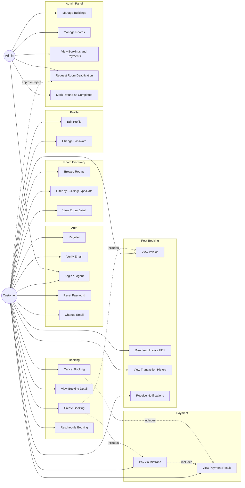

# Use Case Diagram — FlexOffice

Dokumen pendamping `SRS.md`. Diagram dalam notasi Mermaid — bisa dirender langsung di GitHub, GitLab, Obsidian, atau editor Mermaid mana pun.

## Diagram

## Deskripsi Aktor

| Aktor | Deskripsi |
|---|---|
| **Customer** | Pengguna yang mencari dan memesan ruangan (karyawan, freelancer, startup) |
| **Admin** | Operator tunggal yang mengelola gedung, ruangan, booking, dan refund |

## Deskripsi Use Case Kunci

### UC9 — Create Booking
- **Aktor:** Customer
- **Precondition:** Email terverifikasi, nomor telepon terisi
- **Main flow:** Pilih ruangan → pilih tanggal mulai & jumlah unit → lihat ringkasan → lanjut ke pembayaran (UC13)
- **Postcondition:** Booking berstatus `pending_payment`, slot ditahan sampai `expires_at`

### UC11 — Cancel Booking
- **Aktor:** Customer
- **Precondition:** Booking berstatus `confirmed`, belum dimulai
- **Main flow:** Buka detail booking → pilih batal → sistem hitung charge (10% jika <48 jam) → konfirmasi eksplisit
- **Postcondition:** Booking `cancelled`, refund berstatus `pending`

### UC24 — Request Room Deactivation
- **Aktor:** Admin (inisiator), Customer (approver)
- **Precondition:** Ruangan memiliki booking `confirmed` mendatang
- **Main flow:** Admin ajukan nonaktifkan paksa → sistem kirim permintaan persetujuan ke tiap user terdampak → user menyetujui/menolak
- **Postcondition:** Ruangan nonaktif hanya jika seluruh user terdampak menyetujui (lihat OQ-C di PRD.md — kasus penolakan belum diputuskan)

### UC25 — Mark Refund as Completed
- **Aktor:** Admin
- **Precondition:** Booking `cancelled` dengan `refund_status = pending`
- **Main flow:** Admin input nomor referensi transfer → tandai selesai
- **Postcondition:** `refund_status = completed`
